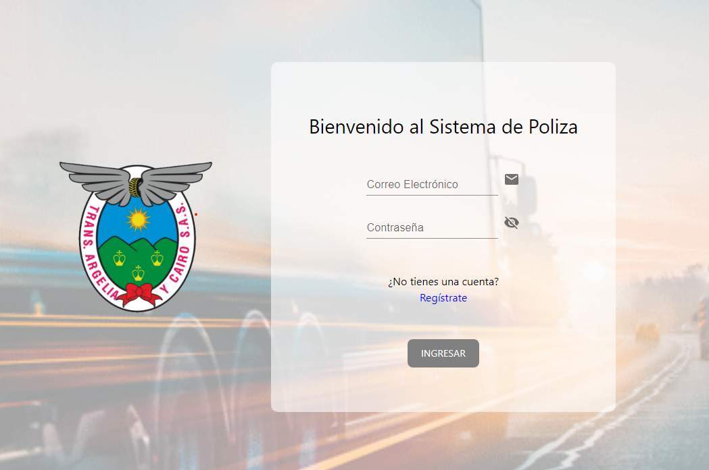

# Proyecto de Gestión de Pólizas para TransArgelia y Cairo

---

Este repositorio contiene el código fuente y la documentación asociada al proyecto de gestión de pólizas desarrollado en colaboración con otro desarrollador en la parte de backend Anderson Serna https://github.com/anderservv.

El objetivo de esta colaboración fue abordar las necesidades específicas de la empresa TransArgelia y Cairo, dedicada al transporte de vehículos en Cartago, Valle del Cauca, Colombia.

## Descripción del Proyecto

---

## El aplicativo web desarrollado tiene como objetivo optimizar la gestión de pólizas para la empresa TransArgelia y Cairo. Permite un control detallado y efectivo de las coberturas, vencimientos y otros aspectos relevantes.

## Tecnologías Utilizadas

---

- **Backend:**
  - PHP
  - Larabel


---

- **Frontend:**
  - React
  - Redux
  - Material-UI


---

- **Base de Datos:**

  - MySQL


---

## Funcionalidades Principales

- Registro y gestión de usuarios y vehículos.
- Administración de pólizas con seguimiento de vencimientos y coberturas.
- Generación de informes y estadísticas para análisis empresarial.

---

## Instrucciones para el Frontend

1. **Clonar el Repositorio:**

   ```bash
   git clone https://github.com/tu-usuario/nombre-del-repositorio.git

   ```

---

2. **Instalación de Dependencias:**
   ```bash
   cd frontend
   npm install
   ```

---

3. **Iniciar la Aplicación:**
   ```bash
   npm start
   ```

---

Acceder a la Aplicación:
La aplicación estará disponible en http://localhost:3000.

## 

## Meta Alcanzada

---

El proyecto ha logrado ofrecer a TransArgelia y Cairo una solución efectiva para la gestión de pólizas, mejorando la eficiencia en el control de coberturas y vencimientos.

## Licencia

---

Este proyecto tiene una licencia solo para uso .
